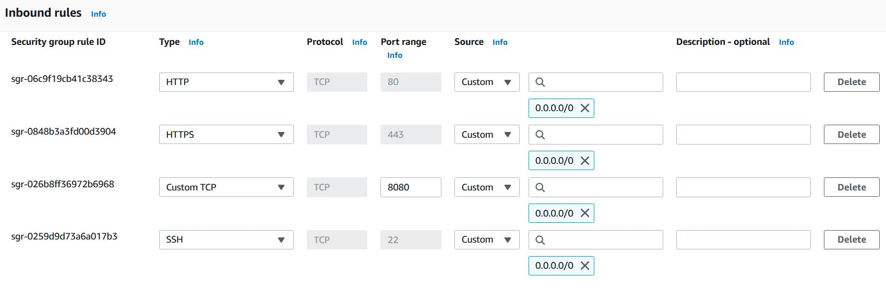
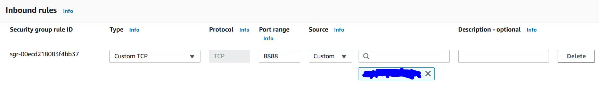
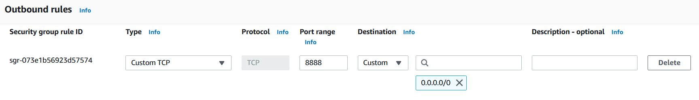
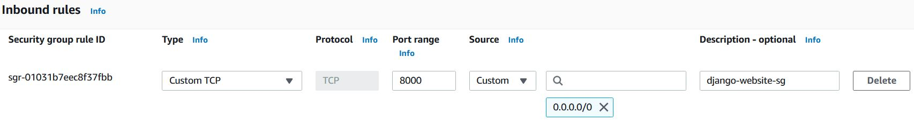
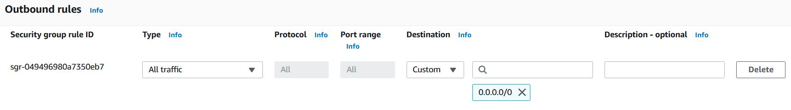
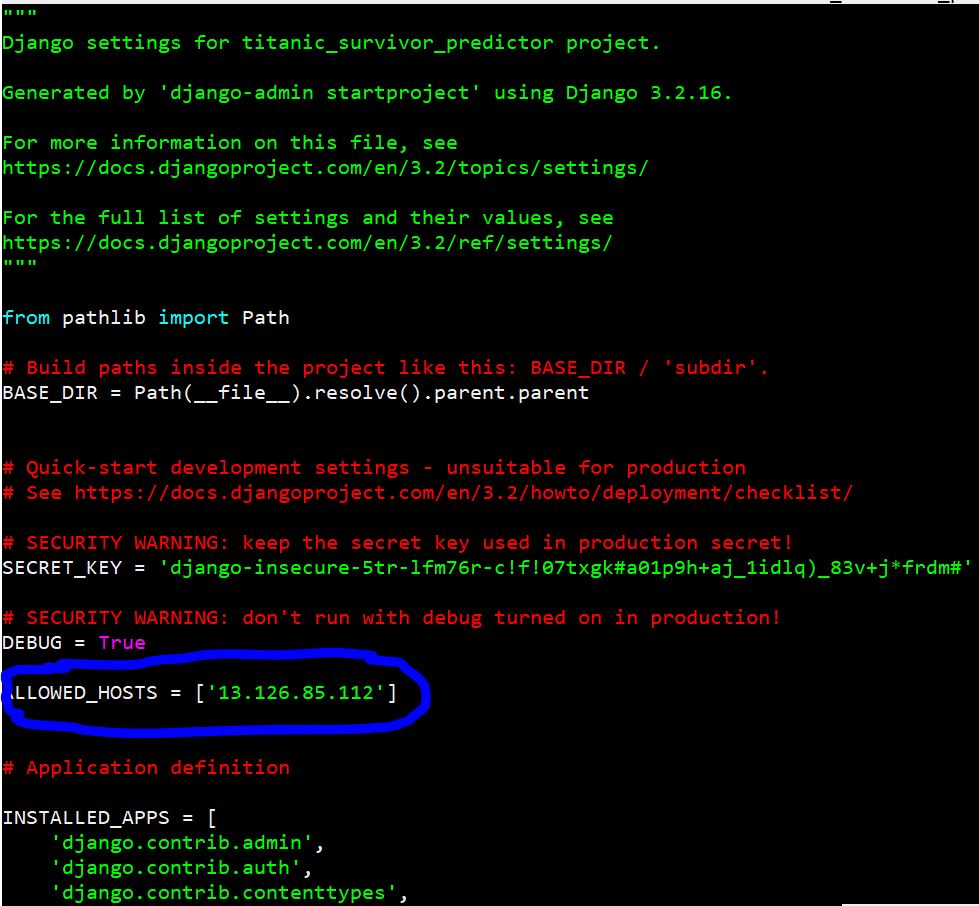
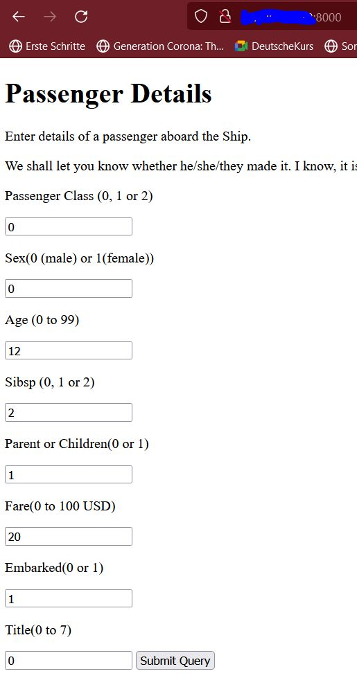
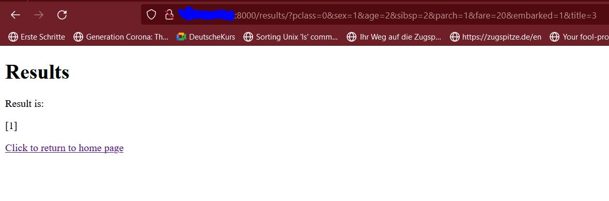

# Running the model on AWS EC2 instance
It is critical that an ML model be run on the server that hosts the website. If this isn't done, then compatibility issues may arise.

With this in mind it's necessary to set up an environment on the AWS EC2 instance which will be able to run the ML model.

Remember that after running the ML model, we need to use the `.sav` file.

## 1. Create an AWS EC2 instance
Create an AWS account, and setup a free-tier EC2 instance. Preferably one with `t2.micro`

---
## 2. Configure the EC2 instance with relevant security groups (SG)
### Default SG


### SG for Jupyter Notebook
Since the model is created using a jupyter notebook (JNB), it's essential that our EC2 instance runs a JNB successfully. JNB by default runs on port `8888`. Therefore create a security group as illustrated in the below images



### SG for Django Website
A Django website by default runs on the port `8000`. Therefore create a separate security group that will run the django website as shown in the images below.



---
## 3. Pull the latest code from Git Repo
```
git clone https://github.com/saikamat/Django-Python-Upskilling.git
```

---
## 4. Install relevant packages and virtual environment
### Update the software packages
```
sudo apt-get update
python3 -V
sudo apt-get install python3-pip
sudo apt-get install python3-dev libpq-dev postgresql postgresql-contrib nginx
```

### Setup the Virtual Environment
```
sudo apt-get install python3-venv
python3 -m venv pyenv
source pyenv/bin/activate
```
### Install the packages
```
pip3 install pandas seaborn
pip3 install -U scikit-learn scipy matplotlib
pip3 install django gunicorn psycopg2 sklearn
pip3 install jupyterlab
```


---
## 5. Run the Jupyter Notebook
``` 
jupyter notebook --generate-config                       # this will create a config file
jupyter notebook password                                # this will request you to create a simple password. Any password is acceptable.
jupyter notebook --ip 0.0.0.0 --no-browser --allow-root  # run the actual notebook
```
Now find the public IPv4 address of your EC2 instance from AWS's EC2 dashboard.

Open a website browser and enter 
```
http://<public IPv4 address>:8888
```
And then run the machine learning `.ipynb` files each cells. One of the cells creates the model file in the `.sav` format.

---
##### (Side note) Incompatibility Issues with VS Studio Code while running Jupyter Notebook on EC2
I have lately noticed that when I use the VS code's built-in JNB interface, the EC2 instance became non-responsive whenever I run a single cell.

One possible root cause could be that I haven't properly configured the security groups for the JNB.

---
## 6. (Optional) Move the model file to the relevant location
The model file that was created by using the JNB, may need to be moved to the parent directory.

---
## 7. Django Setup to run the website
### Change the `ALLOWED_HOSTS` variable in `settings.py`
Set the public IPv4 address in the `settings.py` file as shown below.



### Change the DJANGO website running parameter
Previously the command was `python3 manage.py runserver`
However in the new environment, it should be `python3 manage.py runserver 0.0.0.0:8000`

Open a website browser and enter 
```
http://<public IPv4 address>:8000
```

If all goes well, you should be able to run the website on the above link. Enter the details and get the results.

Data Entry Website


Output


---

